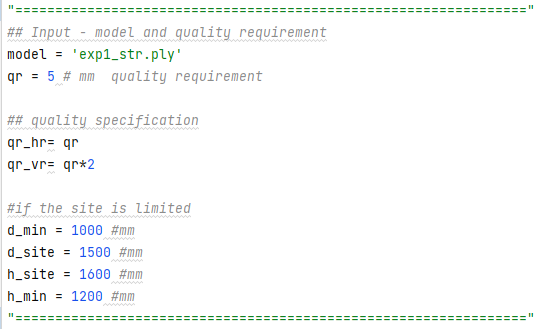
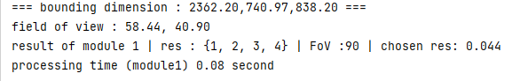

## Local Set up 
### ##Mac version
- update your pip `python3 -m pip install --upgrade pip`
- install open3d `sudo pip3 install open3d==0.13.0` (mac)

### Window version
- update your pip `python -m pip install --upgrade --user pip`
- install open3d `pip3 install --user open3d==0.13.0

1. input.py : User input handles only this script => no further modules need to be changed 

2. module1.py : choosing the scan `resolution`

   * from output summaries, use `fov` and `chosen res`
3. module2.py : transform `mesh` object to `points`
4. module4.py : create `potential scan locations` around the object and store in `final_pts`
5. module6.py : create `satisfied_set` and `visible_set` for each `potential scan location`
6. module7.py : For each `object point` count the number of `potential scan locations` that satisfies the quality requirement
   * counting number tells which `object point` is relatively easier to be captured.
7. module8.py : compute `low_score_criteria` and find what object `points` are in `low_score_criteria`
8. module9.py : choose the `first_scan` and then choose subsequent scan positions until it closes to the `first position`

